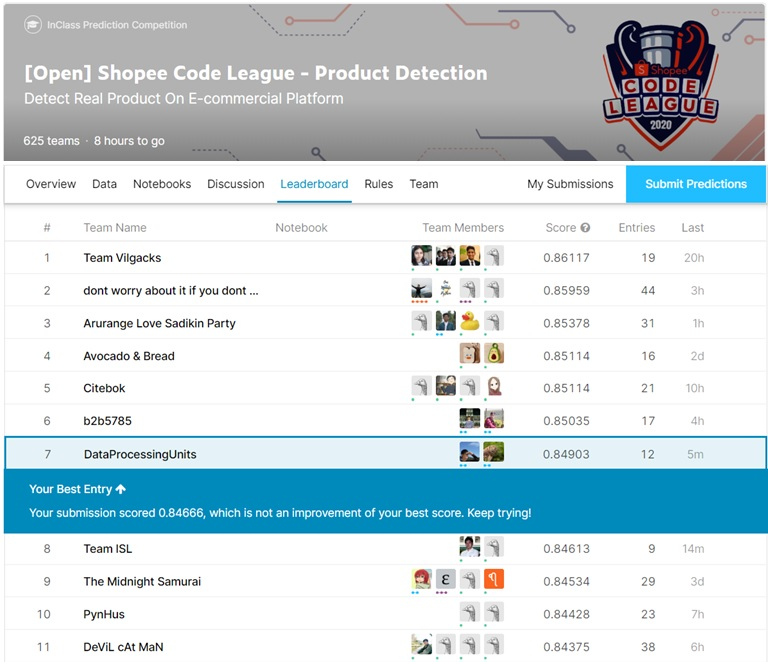
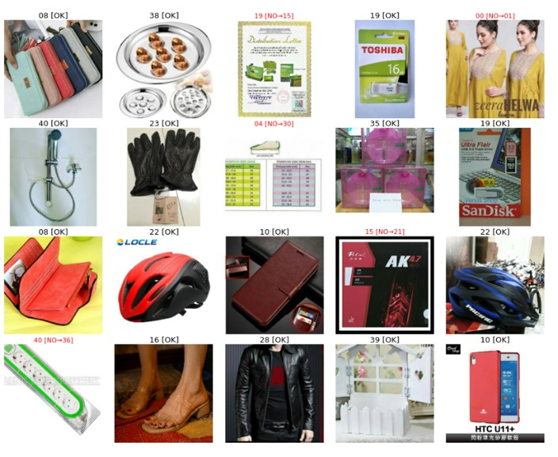

# Shopee Code League - Product Detection  
In this competition, I team up with [yurayli](https://github.com/yurayli), He is my best teammate and mentor in data science. If you have any interest with him, you can access his github(https://github.com/yurayli)
### Ranking: 7/646 (Top2%)
## Leadboard 

## Task
In this competition, a multiple image classification model needs to be built. There are **~100k images** within **42 different categories**, including essential medical tools like masks, protective suits and thermometers, home & living products like air-conditioner and fashion products like T-shirts, rings, etc. For the data security purpose the category names will be desensitized. The evaluation metrics is top-1 accuracy.

## Dataset

- Training set is collected from shopee online stories
- 42 Classes in total
