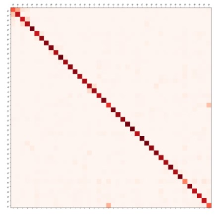

# Shopee Code League - Product Detection  
In this competition, I team up with [yurayli](https://github.com/yurayli), He is my best teammate and mentor in data science. If you have any interest with him, you can access his github(https://github.com/yurayli)
### Ranking: 7/646 (Top2%)
## Leadboard 

## Task
In this competition, a multiple image classification model needs to be built. There are **~100k images** within **42 different categories**, including essential medical tools like masks, protective suits and thermometers, home & living products like air-conditioner and fashion products like T-shirts, rings, etc. For the data security purpose the category names will be desensitized. The evaluation metrics is top-1 accuracy.

## Dataset
Training set is collected from shopee online stories 

## Timeline
June 20, 2020 - Competition Start. 
July 4, 2020 - Private leaderboard revealed. 
July 4, 2020 - Final submission deadline. 

## Evaluation
Accuracy score between predictions and ground truth of each test sample.

## Method
1. Label Smoothing 
After checking the confusion matrix from the baseline model, we figure out that it is vague between some categories. Some images are hard to assign to a specific category, 
even if check it by ourown. That's why we use "lebel smoothing" trick to improve the model accuracy on test set.
 

2. Data Augmentation
To avoid high varience problem, we impelemented data augmentation. We also made special functions to randomly twist or adding balck block in images. 

3. One-Cycle Policy / Cyclic Learning Rate
Rather than training model with thousands iteration, Using cyclic learning rate could get the same baseline accuracy with smaller epochs. It's also help us get ride out of saddel point while model training. You can check [here](https://towardsdatascience.com/finding-good-learning-rate-and-the-one-cycle-policy-7159fe1db5d6) to get intuition sense about one-cycle policy. 
We wrote a new code to control learning rate on each iterator during training(as the picture below), and It made us get significant imporve on accuracy of test set.
 

## Model
